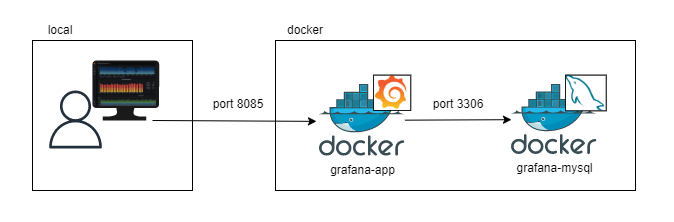

# docker-grafana

## app component



## usage

1. start app
```bash
make up
```
2. login and open [dashboard link](http://localhost:8085/d/k3TRenbVz/sample-dashboard?orgId=1)

```bash
default-username: grafana-user
default-password: password
```

3. stop app
```bash
make stop
```

4. remove app
```
make rm
```